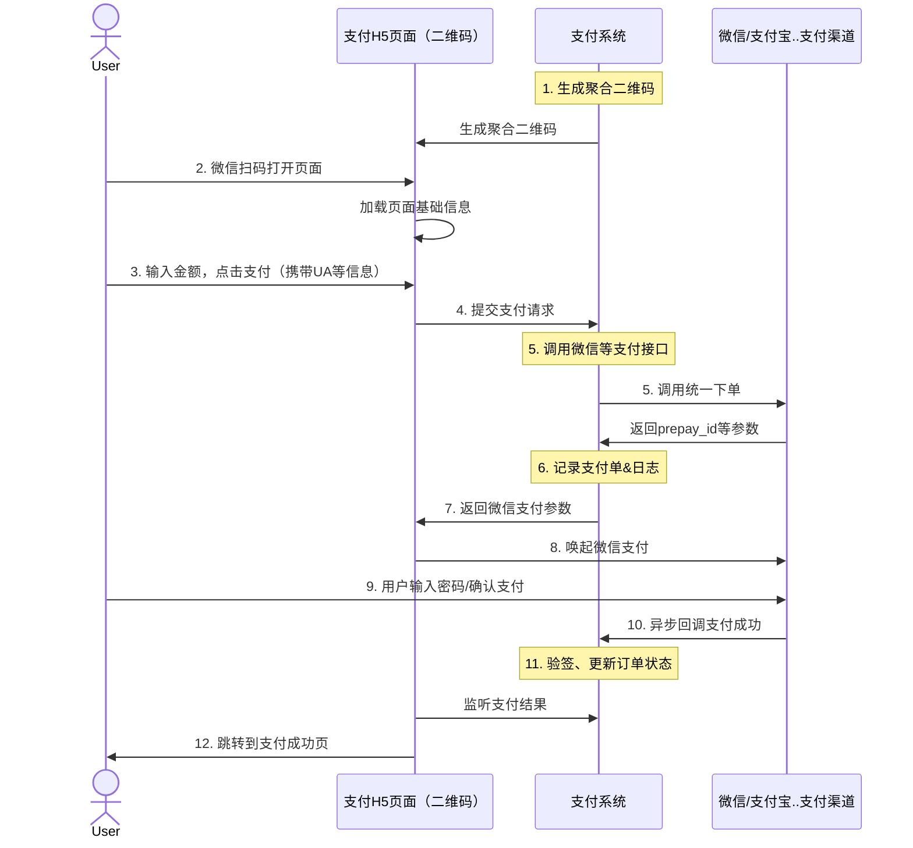
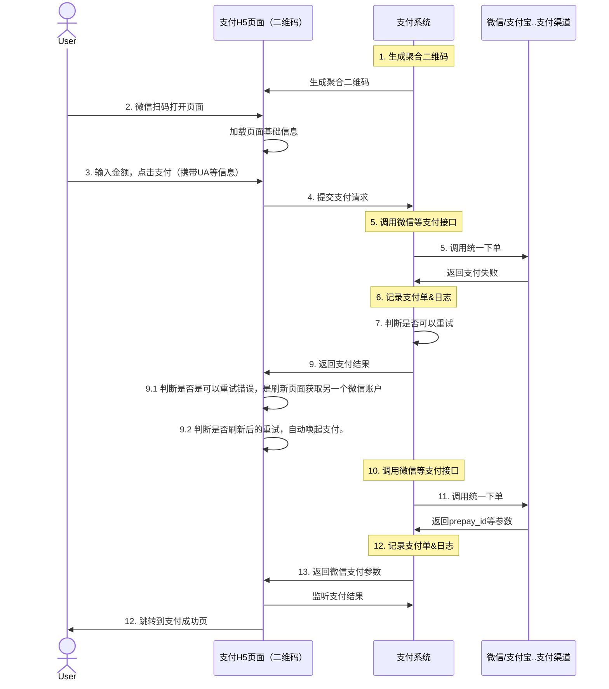
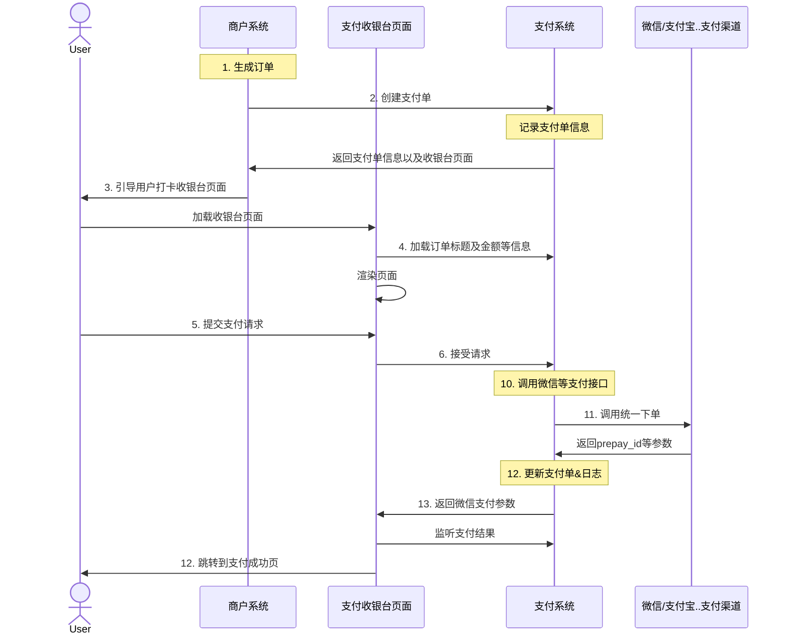
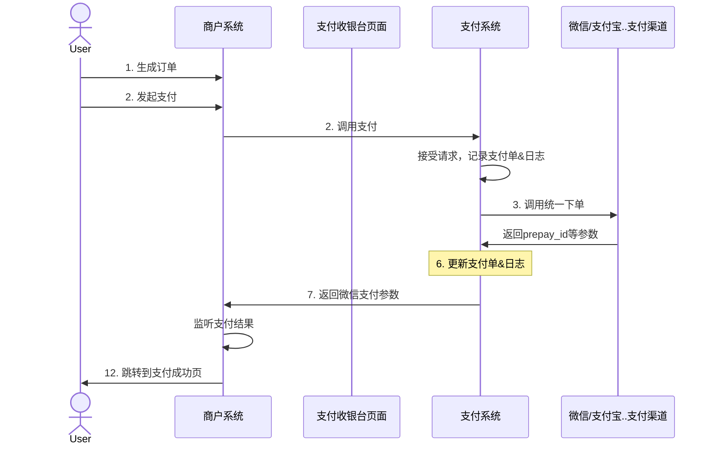

### 项目介绍
   本系统支持多商户多应用的聚合支付系统。在支付渠道支持微信、支付宝、富友支付等。支付渠道动态配置，新增支付渠道只需按照规范设置对应配置即可。
### 项目特点
1. 聚合支付系统，基于多商户多应用的聚合支付系统。
2. 适配多支付渠道，新增支付渠道按照 sdk 规范适配即可。
3. 支持单应用配置多微信账户支付。
4. 支付失败，收银台自动轮询重试支付。
5. 在应用支持多微信账户应用,开启路由模式，自动屏蔽微信限制支付，限制获取用户openid的微信账户

### 业务流程

#### 聚合码支付
##### 非支持多微信账户应用

##### 支持多微信账户应用

#### 收银台支付
##### 非多微信账户应用

##### 多微信账户应用
重试流程和聚合码支付一致
#### 接口支付
接口支付对于多微信账户应用，需要先获取微信账户信息，再进行支付。因此商户系统在调用支付接口的时候需要传递在支付系统中支付渠道的编码以及商户系统获取到的openid。如果不是多微信账户应用，则不需要传递支付渠道的编码。

### 功能模块
1. 商户管理
   1. 商户信息管理
   2. 商户状态管理
   3. 商户用户管理
2. 应用管理
   1. 应用信息管理
   2. 应用聚合二维码生成
   3. 应用下支付配置
3. 支付
   1. 支付列表
   2. 支付详情
   3. 支付退款
   4. 支付超时关闭
   5. 支付退款发起
4. 支付路由
   1. 路由条件 监听到获取用户openid受到微信限制
   2. 路由条件 监听到支付受到微信限制（如达到最大收款次数）
   3. 路由条件 应用支付账户配置的日最大收款次数
5. 退款
   1. 退款列表
   2. 退款详情
6. 数据看板
7. 菜单管理等

### 模块截图
#### 商户管理

#### 应用管理

#### 数据看板

